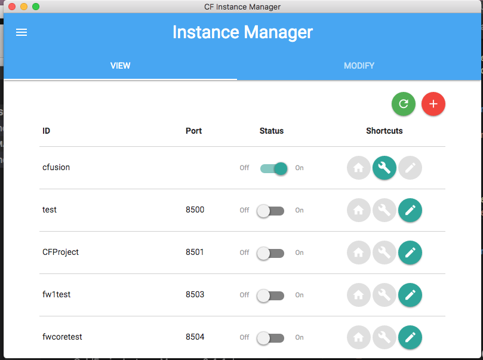

# CFInstanceManager
Instance Manager for ColdFusion

Go to releases to download the newest version.

**Note: In order for CFInstancemanager to correctly read your old instances your .properties name must be the same as your instance.

Example:

Instance ID: cftest

Properties Filename must be: cftest.properties
